# ArberCharts

ArberCharts is a premium Java charting framework focused on performance, clarity, and presentation‑grade rendering.
It targets production systems that demand stable APIs, clean UX, and a fast pipeline.

**139 renderers** across Standard, Financial, Statistical, Specialized, Medical, and Analysis domains.

## Important Note

This public repository is used for releases only.  
The source code is proprietary and is not published here.

## Highlights

- Performance‑first rendering with a zero‑GC mindset
- Fluent API with ArberChartBuilder
- 139 renderers across multiple domains
- Demo application for presentation‑grade visuals

## Downloads

Release assets are published on GitHub Releases:
- Core JAR: `arbercharts-core-1.0.0.jar`
- Demo JAR: `arbercharts-demo-1.0.0.jar`
- Installers: macOS (.dmg), Windows (.msi), Linux (.deb)

## Screenshots

Selected chart previews (from `site/images`):

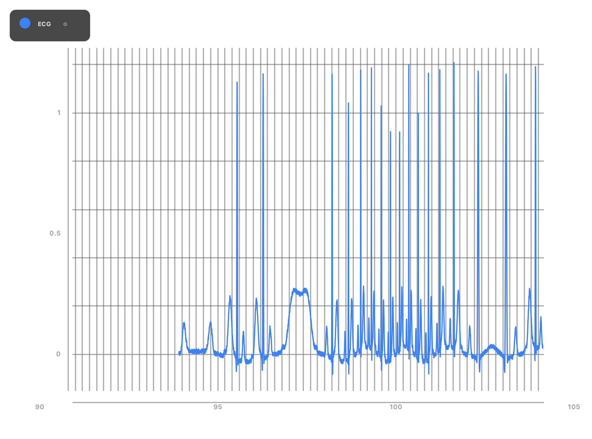
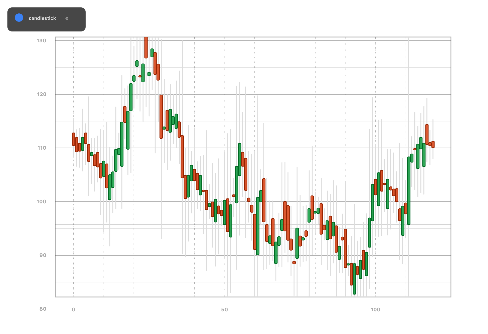
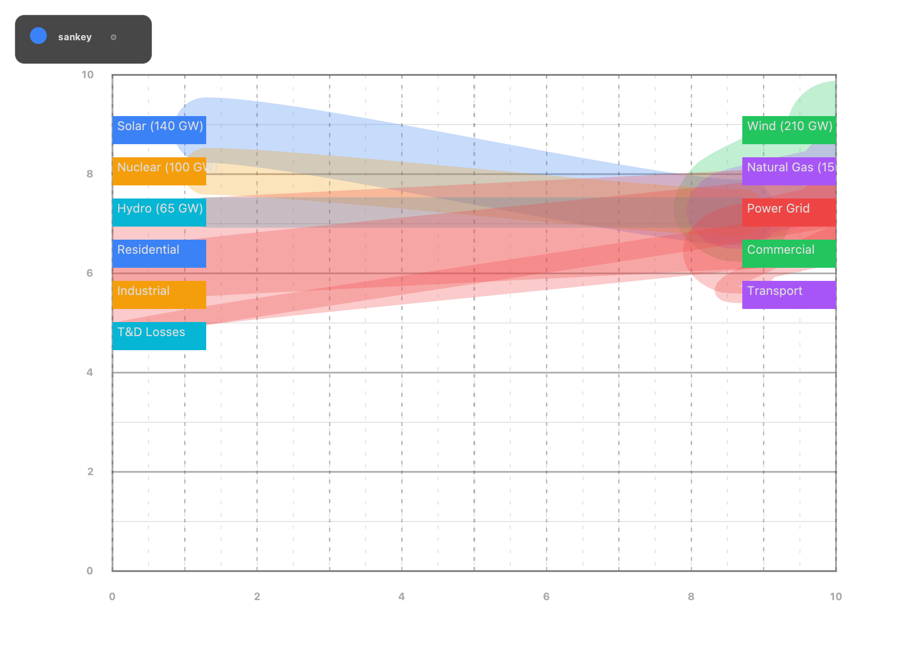
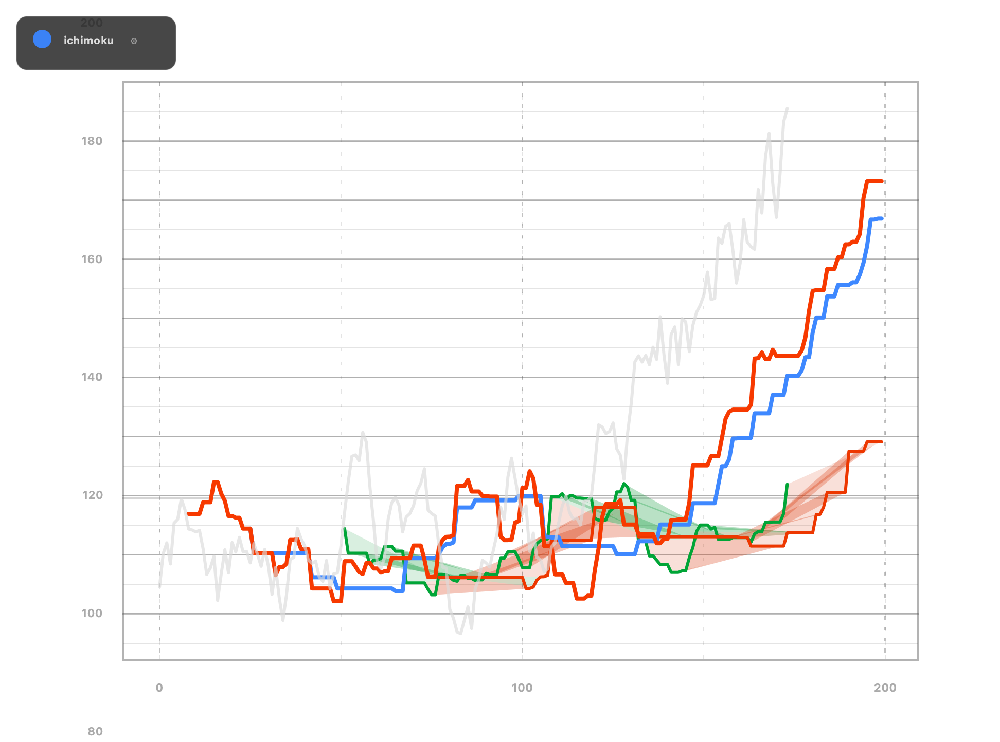
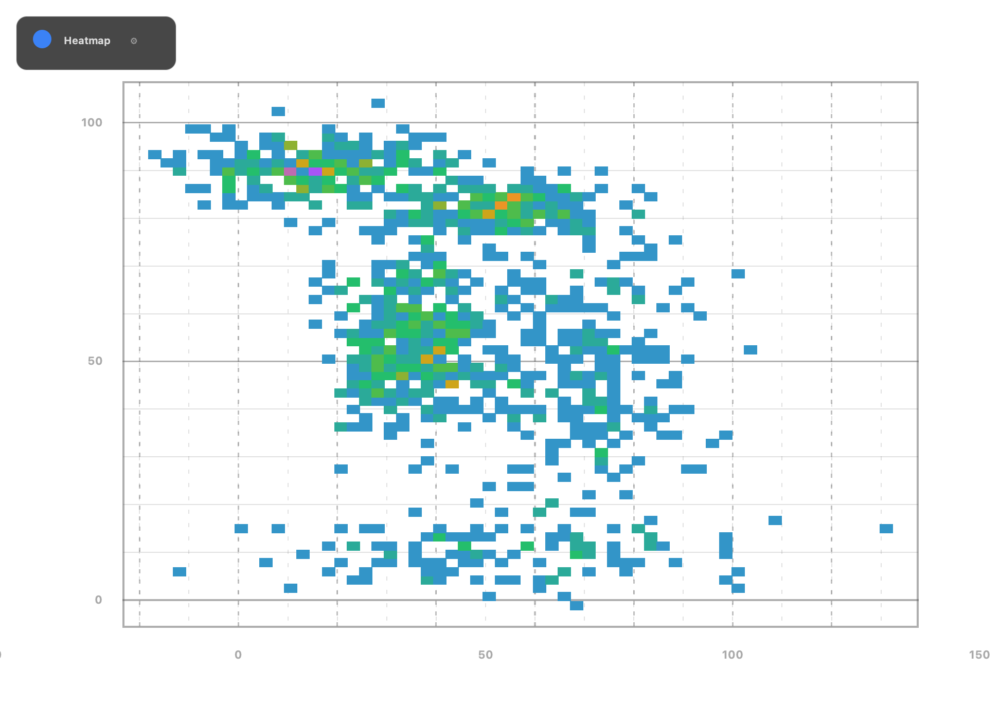
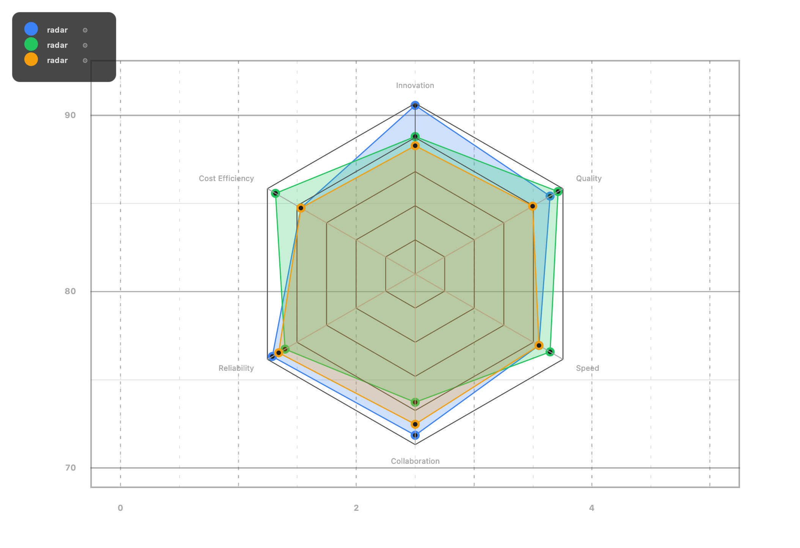
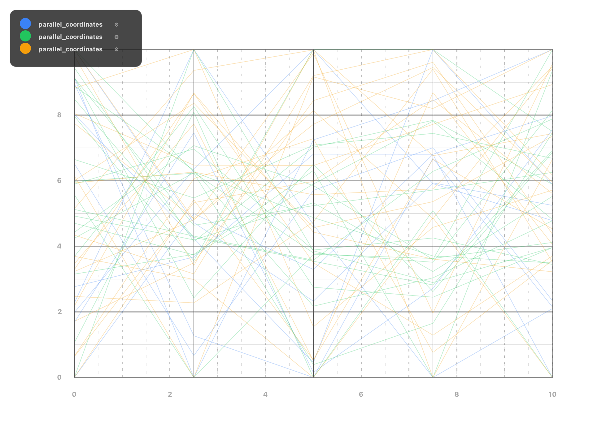
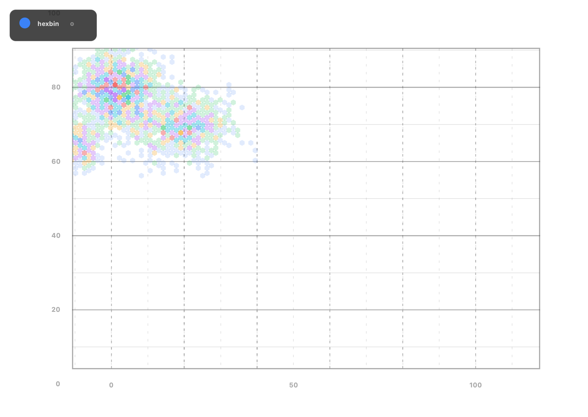
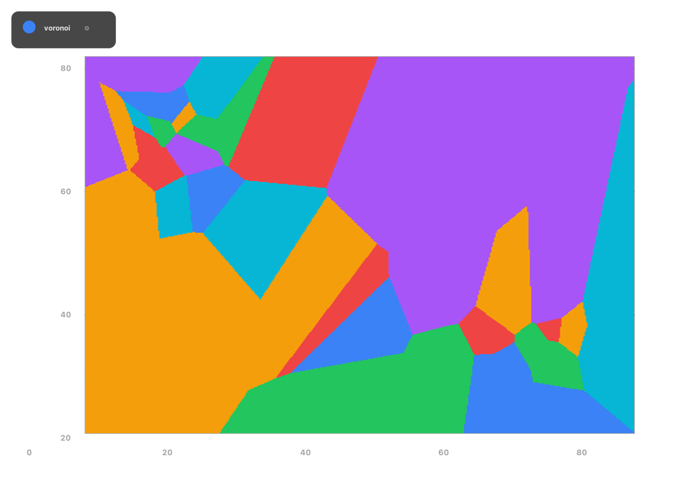
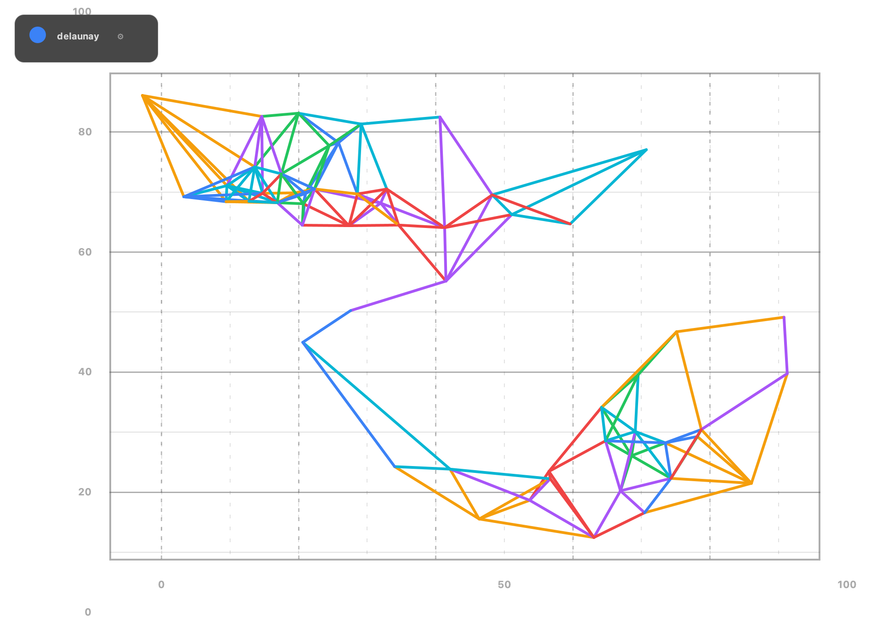
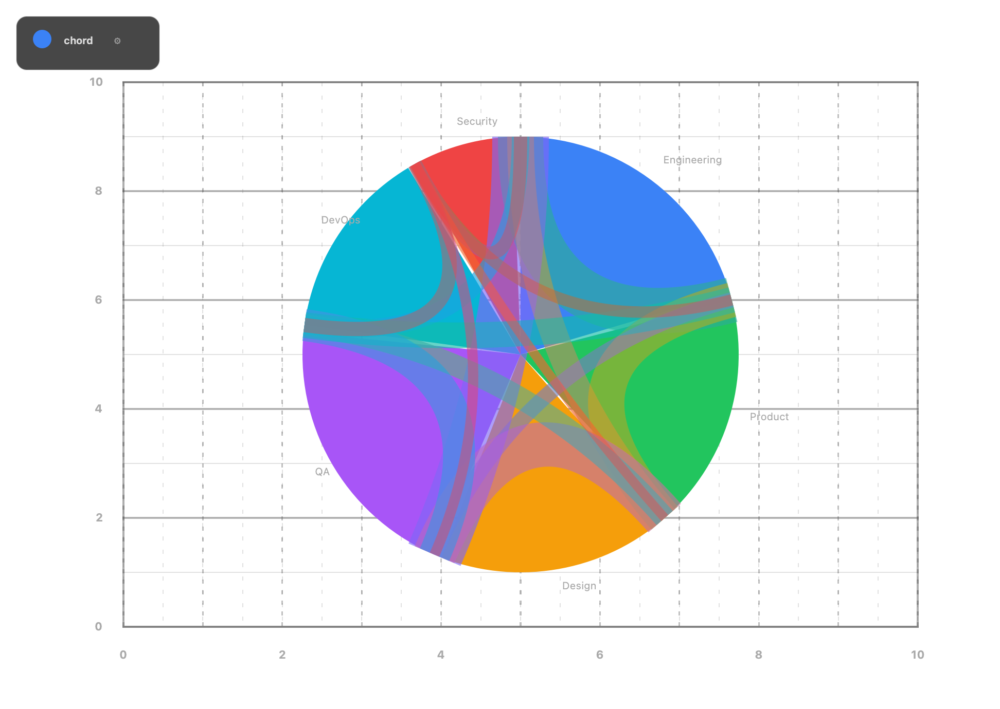
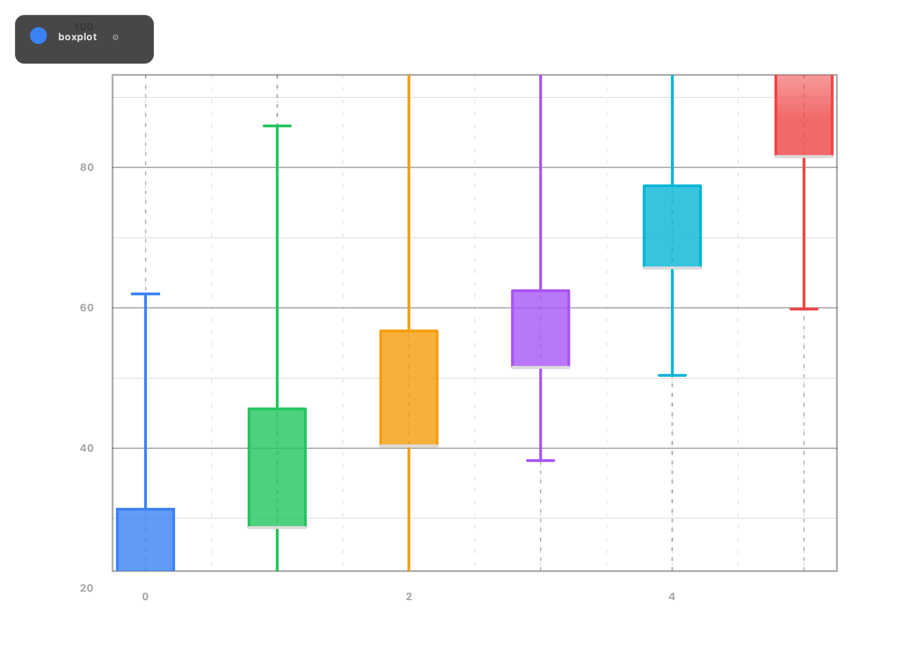

## Quick Start (Demo)

```bash
java --enable-native-access=ALL-UNNAMED -jar arbercharts-demo-1.0.0.jar
```

## System Requirements

- Java 25 recommended

## License (Proprietary)

- Developer License: free and unlimited for development & evaluation
- Runtime/Distribution License: required for commercial products shipped to end customers

## Support

gashi@pro-business.ch  
https://www.arbergashi.com
