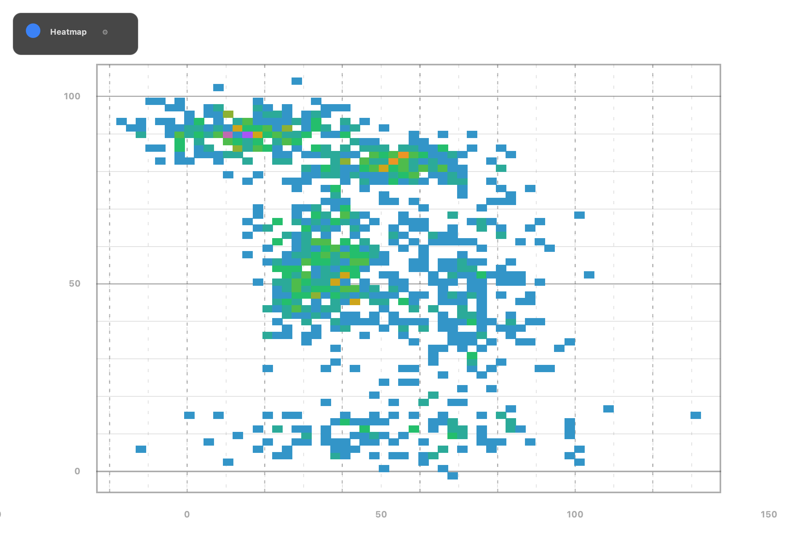

# ArberCharts 2.0.0 GitHub Release Bundle

Dieses Verzeichnis ist für die direkte GitHub-Auslieferung vorbereitet.
Es enthält die freigegebenen Artefakte, begleitende Doku und Vorschau-Bilder.

## Inhalt

### Artefakte (`artifacts/`)
- `arbercharts-core-2.0.0.jar`
- `arbercharts-demo-2.0.0.jar`
- `arbercharts-starter-2.0.0.jar`
- `run-demo.sh`
- `run-demo.bat`
- `SHA256SUMS.txt`

### Bilder (`images/`)
- `candlestick.png`
- `heatmap.png`
- `sankey.png`
- `voronoi.png`
- `boxplot.png`
- `parallelcoordinates.png`

### Dokumentation (`docs/`)
- `RELEASE_NOTES.md`

## Demo starten

Voraussetzung: **Java 25+**

```bash
java --enable-native-access=ALL-UNNAMED --add-modules jdk.incubator.vector -jar artifacts/arbercharts-demo-2.0.0.jar
```

Alternativ:

```bash
./artifacts/run-demo.sh
```

## Integrität prüfen

```bash
cd artifacts
shasum -a 256 -c SHA256SUMS.txt
```

## Lizenz

- Binärartefakte: MIT
- Siehe `LICENSE`, `NOTICE`, `BINARY-LICENSE.md` im Repository-Root.

## Bildvorschau





