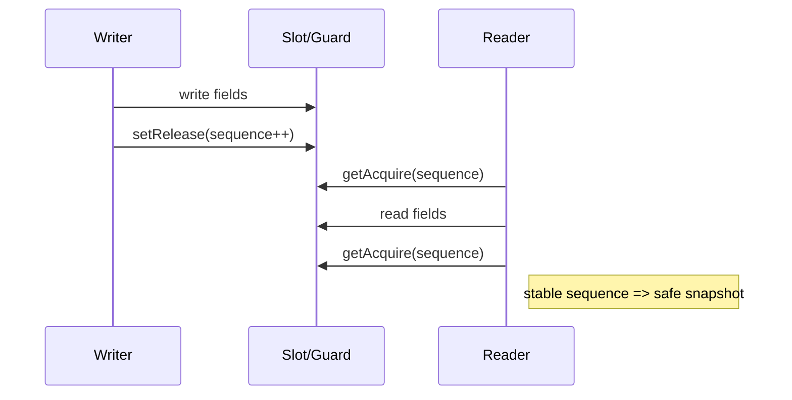

# Concurrency Model (Core)

## Scope
This document describes concurrency guarantees and memory-ordering assumptions for ArberCharts Core data models and render paths. The primary goal is to ensure deterministic, lock-free reads under continuous streaming workloads.

## Key Guarantees
- **Lock-free reads:** Readers do not block writers.
- **Deterministic read snapshots:** Readers observe consistent multi-field data.
- **Allocation-free hot path:** No allocations on critical rendering paths.

## Memory-Ordering Summary
Core lock-free structures rely on acquire/release semantics to enforce happens-before relationships between writers and readers. Readers observe published data only after the writer has completed the multi-field update.

## Happens-Before (Conceptual)
1. Writer publishes field values (data arrays / slots).
2. Writer updates the sequence guard with a release store.
3. Reader performs acquire read of the sequence guard.
4. If guard is stable, reader consumes fields safely.

## Reader/Writer Interleaving (High Level)
```
Writer: write fields -> release store sequence
Reader: acquire load sequence -> read fields -> acquire load sequence
```

## Formal Verification Hints
- **JCStress test cases:** reader/writer race conditions.
- **Memory model proof:** happens-before chain via VarHandle getAcquire/setRelease.
- **Known limitations:**
  - Long wraparound after 2^63 writes (theoretical).
  - Spin-wait under extreme contention (>100 concurrent writers).

## Diagram (Mermaid)


## Performance Characteristics
- Contention impact is bounded by spin-wait + retry loops.
- Readers remain non-blocking and can make progress independently.

## Documentation Notes
This is a documentation artifact only. It describes existing behavior and constraints without requiring core code changes.
